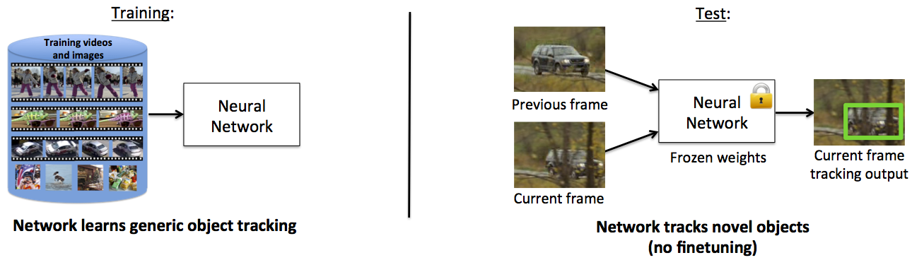

# GOTURN

This is the code for our tracker, GOTURN: Generic Object Tracking Using Regression Networks.

GOTURN appeared in this paper:

**[Learning to Track at 100 FPS with Deep Regression Networks](http://davheld.github.io/GOTURN/GOTURN.html)**,
<br>
[David Held](http://davheld.github.io/),
[Sebastian Thrun](http://robots.stanford.edu/),
[Silvio Savarese](http://cvgl.stanford.edu/silvio/),
<br>
European Conference on Computer Vision (ECCV), 2016 (In press)

GOTURN addresses the problem of **single target tracking**: given a bounding box label of an object in the first frame of the video, we track that object through the rest of the video.  

Note that our current method does not handle occlusions; however, it is fairly robust to viewpoint changes, lighting changes, and deformations.  Here is a brief overview of how our system works:



Using a collection of videos and images with bounding box labels (but no
class information), we train a neural network to track generic objects. At test time, the
network is able to track novel objects without any fine-tuning. By avoiding fine-tuning,
our network is able to track at 100 fps.

If you find this code useful in your research, please cite:

```
@inproceedings{held2016learning,
  title={Learning to Track at 100 FPS with Deep Regression Networks},
  author={Held, David and Thrun, Sebastian and Savarese, Silvio},
  booktitle = {European Conference Computer Vision (ECCV)},
  year      = {2016}
}
```

Contents:
* [Installation](#installation)
* [Downloading a pretrained model](#pretrained-model)
* [Visualize the tracking performance](#visualize-the-tracking-performance)
* [Evaluate the tracker](#evaluate-the-tracker)
* [Train the tracker](#train-the-tracker)
* [Visualizing datasets](#visualizing-datasets)

## Installation

### Install dependencies:

* Install CMake:
```
sudo apt-get install cmake
```

* Install Caffe and compile using the CMake build instructions:
http://caffe.berkeleyvision.org/installation.html

* Install OpenCV
```
sudo apt-get install libopencv-dev
```

* Install TinyXML (needed to load Imagenet annotations):
```
sudo apt-get install libtinyxml-dev 
```

### Compile

From the main directory, type:
```
mkdir build
cd build
cmake ..
make
```

## Pretrained model
You can download a pretrained tracker model (434 MB) by running the following script from the main directory:

```
bash scripts/download_trained_model.sh
```

## Visualize the tracking performance
To visualize the performance of the tracker, first downloaded a pretrained tracker model (above).

### Visualizing test set performance
To visualize the performance on the test set, first download (and unzip) the [VOT 2014 dataset](http://www.votchallenge.net/vot2014/dataset.html).

Then you can run the tracker on the test set and visualize the output by running the following script:
```
bash scripts/show_tracker_test.sh vot_folder
```
where vot_folder is the path to the unzipped VOT files.

### Save videos of test set performance

To save videos of the tracker running on the test set, run the script:
```
bash scripts/save_videos_test.sh vot_folder
```

### Visualizing validation set performance

To visualize the performance on the validation set, first download the ALOV dataset (as described below)

Then you can run the tracker on the validation set and visualize the output by running the following script:
```
bash scripts/show_tracker_val.sh alov_image_folder alov_annotation_folder
```
where alov_videos_folder is the path to the ALOV videos folder and alov_annotations_folder is the path to the ALOV annotations folder.

Note that, for the pre-trained model downloaded above, after choosing hyperparameters, the model was trained on the training+validation sets (not the test set!) so we would expect the validation performance here to be very good (much better than test set performance).

## Evaluate the tracker

### Evaluate test set performance

To evaluate test set performance, follow the instructions on the [VOT website](http://www.votchallenge.net/howto/index.html).
The file test/test_tracker_vot.cpp is designed to integrate into the VOT testing framework.

### Evaluate validation set performance
To evaluate the trained tracker model on the validation set, run:

```
bash scripts/evaluate_val.sh alov_image_folder alov_annotation_folder 
```

Note that, for the pre-trained model downloaded above, after choosing hyperparameters, the model was trained on the training+validation sets (not the test set!) so we would expect the validation performance here to be very good (much better than test set performance).

## Train the tracker

To train the tracker, you need to download the training sets: 

### ALOV dataset

The ALOV video dataset can be downloaded here: http://alov300pp.joomlafree.it/

Click "Download Category" and "Download Ground Truth" to download the dataset (21 GB).

You need to make sure that the training set is distinct from your test set.  If you intend to evaluate the tracker on  VOT 2014, then you should remove the following videos from your ALOV training set:
* 01-Light\_video00016 
* 01-Light\_video00022 
* 01-Light\_video00023 
* 02-SurfaceCover\_video00012 
* 03-Specularity\_video00003 
* 03-Specularity\_video00012 
* 10-LowContrast\_video00013

### Imagenet dataset

To download the ImageNet images, first register here:
http://www.image-net.org/download-images

After registration, follow the links to download the ILSVRC2014 image data, and then download the DET dataset training images (47 GB) and the DET dataset training bounding box annotations (15MB).

Unzip both of these files.  The image folder contains a collection of more tar files which must be unzipped.  To do so, call:
```
bash scripts/unzip_imagenet.sh imagenet_folder output_folder
```
where imagenet_folder is the name of the file that was downloaded and unzipped, and target_folder is the destination folder for all of the unzipped images.

### Training
If you are evaluating multiple models for development, then you need to have a validation set that is separate from your training set that you can use to choose among your different models.  To separate the validation set, make sure that, in loader/loader_alov.cpp, the variable val_ratio is set to 0.2.  This will specify that you want to train on only 80% of the videos, with 20% of the videos being saved for validation.  After your final model and hyperparameters have been selected, you can set val_ratio to 0 to train the final model on the entire training + validation sets (not the test set!).  

To train the tracker, you first need to download a set of weights that will initialize the convolutional layers from ImageNet.  To do so, call
```
bash scripts/download_model_init.sh
```

Next, run:
```
bash scripts/train.sh imagenet_folder imagenet_annotations_folder alov_videos_folder alov_annotations_folder
```
to train the tracker, where:
imagenet_folder is the directory of ImageNet images
imagenet_annotations_folder is the directory of Imagenet image annotations
alov_videos_folder is the directory of ALOV videos
alov_annotations_folder is the directory of ALOV video annotations.
 
The tracker will be saved every 50,000 iterations in the folder: nets/solverstate
We recommend to use the model after it has been trained for at least 200,000 iterations.  In our experiments, we trained our models for 450,000 iterations (which was probably overkill).  Still, you should be able to see some progress after just 50,000 iterations.

The detailed output of the training progress will be saved to a file in nets/results that you can inspect if you wish.

## Visualizing datasets

### Visualizing the ALOV dataset

After downloading the ALOV video dataset that we use for training (see above), you can visualize this dataset by calling:
```
build/show_alov alov_videos_folder alov_annotations_folder
```
where alov_videos_folder is the path to the ALOV videos folder and alov_annotations_folder is the path to the ALOV annotations folder.

### Visualizing the ImageNet dataset

After downloading the ImageNet image dataset that we use for training (see above), you can visualize this dataset by calling:
```
build/show_imagenet imagenet_folder imagenet_annotations_folder
```
where imagenet_folder is the path to the ImageNet image folder and imagenet_annotations_folder is the path to the ImageNet annotations folder.

